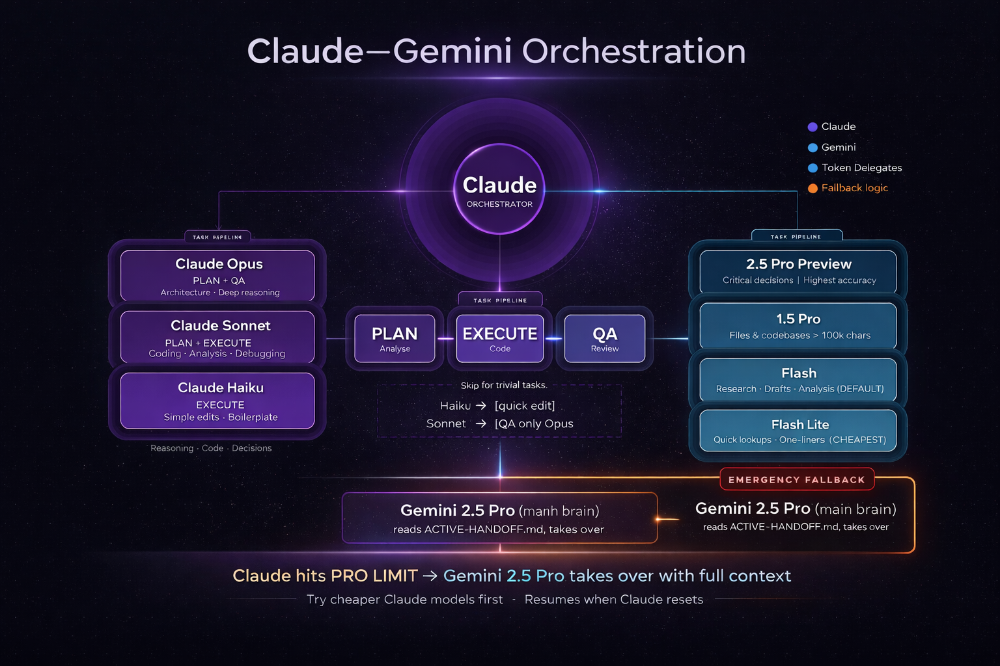

# Claude + Gemini Orchestration Framework

[](https://opensource.org/licenses/MIT)
[](CLAUDE.md)
[](setup/)
[](https://claude.ai/code)

> **Use Claude as your AI brain. Use Gemini as your token-saving engine. Never lose context. Never hit the limit mid-task.**

A production-grade orchestration framework that wires Claude and Gemini together with a strict hierarchy, a structured 3-phase task pipeline, and a zero-loss fallback system — so you can work longer, spend less, and pick up exactly where you left off even when Claude Pro goes offline.



---

## The Problem This Solves

Most people use Claude for everything — research, writing, code, analysis. That burns through the Pro token limit fast. When it hits, you lose context and start over.

This framework fixes that with three ideas:

1. **Claude handles what only Claude can do** — reasoning, code, architecture, judgment
2. **Gemini handles what doesn't need Claude** — bulk research, large docs, content drafts (1–2M token context, cheap to run)
3. **When Claude hits its limit, Gemini takes over with full context** — and hands back cleanly when Claude resets

The result: more work per session, lower cost, zero context loss.

---

## What's In This Repo

```
/
├── CLAUDE.md                    ← the global ruleset — drop this in ~/.claude/
├── README.md                    ← this file
├── setup/
│   ├── windows.md               ← Windows setup (Git Bash / WSL)
│   ├── mac.md                   ← macOS setup
│   └── gemini-fallback.sh       ← script that hands off to Gemini when Claude goes offline
└── examples/
    └── project-CLAUDE.md        ← example project-level config
```

---

## How It Works

### The Brain Hierarchy

```
You (CEO)
    │
    ▼
Claude (Orchestrator — main brain, decision maker, always in control)
    │
    ├── [TASK PIPELINE — every multi-step task runs 3 phases]
    │     Phase 1: PLAN    → strongest model reasons, analyses, structures the approach
    │     Phase 2: EXECUTE → cheapest model that can handle it writes, applies, generates
    │     Phase 3: QA      → one tier above executor reviews before you see it
    │
    │     TRIVIAL TASK — skip pipeline entirely (no sub-agent, no QA):
    │       A task is trivial if ALL of the following are true:
    │         ✓ Single file written or modified (reads don't count)
    │         ✓ No production or live data affected
    │         ✓ Fully reversible in one step
    │         ✓ Under 3 tool calls total
    │       Examples: single-line edit, rename, grep, quick lookup, clarification
    │
    ├── [CLAUDE SUB-AGENTS — reasoning, code, decisions] ← ALWAYS preferred over Gemini
    │     ├── Claude Haiku    → EXECUTE tier: simple edits, file reads, boilerplate
    │     │                     QA reviewed by: Sonnet
    │     ├── Claude Sonnet   → PLAN + EXECUTE: coding, analysis, debugging (default)
    │     │                     QA reviewed by: Opus
    │     └── Claude Opus     → PLAN + QA: complex architecture, large refactors
    │                           Only used when no cheaper model can handle it
    │
    ├── [GEMINI SUB-AGENTS via MCP — token-saving specialists] ← NOT for code or judgment
    │     ├── gemini-2.0-flash-lite   → trivial lookups, quick one-liners (cheapest)
    │     ├── gemini-2.0-flash        → content drafting, research, analysis (DEFAULT)
    │     ├── gemini-2.0-flash        → document/file analysis under 100K chars
    │     ├── gemini-1.5-pro          → massive files, entire codebases over 100K chars
    │     ├── gemini-2.0-flash        → compare two files or configs
    │     └── gemini-2.5-pro-preview  → highest reasoning quality, critical decisions
    │
    │     MCP FAILURE FALLBACK — if any Gemini tool errors or times out:
    │       → Claude handles the task directly using the next cheapest Claude model
    │       → Failure is logged to AI-SHARED-LOG.md
    │
    └── [EMERGENCY FALLBACK — when Claude Pro hits its usage limit mid-session]
          └── Gemini 2.5 Pro becomes the temporary main brain
                │  You run: bash ~/.claude/shared-memory/gemini-fallback.sh
                │  It reads ACTIVE-HANDOFF.md and picks up exactly where Claude left off
                │  (No Claude sub-agents during this period — Claude is offline)
                │
                ├── PLAN + DECIDE: gemini-2.5-pro-preview  ← orchestrates everything
                ├── EXECUTE:       gemini-2.0-flash         ← heavy generation, bulk tasks
                └── QA:            gemini-2.5-pro-preview   ← reviews before you see it

    When Claude Pro resets → Claude reads the resume brief → takes back control.
    Gemini returns to specialist role. You never re-explain context.
```

**Core principle:** Claude always makes the final call. Gemini saves tokens. Neither replaces the other.

---

### Planner → Executor → QA Table

Every non-trivial task follows this pipeline. The right model is picked automatically based on complexity:

| Task Type | Planner | Executor | QA | Notes |
|---|---|---|---|---|
| File read, grep, rename | — | Claude Haiku | skip | Trivial — no pipeline needed |
| Simple code edit / boilerplate | — | Claude Haiku | Claude Sonnet | QA only if touches production |
| Coding, debugging, analysis | Claude Sonnet | Claude Haiku | Claude Sonnet | Default 80% of coding tasks |
| Refactor / multi-file change | Claude Opus | Claude Sonnet | Claude Opus | Architecture-level work |
| Explore codebase / research | — | Gemini Flash | skip | Pure content — Gemini wins |
| Web research / summarization | — | Gemini Flash | skip | Token-heavy, no judgment needed |
| Analyze doc < 100K chars | Gemini Flash | Gemini Flash | skip | Self-contained analysis |
| Analyze doc > 100K chars | Gemini Flash | Gemini 1.5 Pro | skip | Only model with 2M context |
| Compare two files / configs | — | Gemini Flash | skip | Simple comparison task |
| Code review + fix | Gemini Flash | Claude Haiku | Claude Sonnet | Gemini drafts, Claude fixes |
| Generate boilerplate / copy | — | Gemini Flash Lite | Gemini Flash | Cheapest path for bulk output |
| Critical architecture decision | Claude Opus | Claude Sonnet | Claude Opus | Highest reasoning required |

> **QA trigger rule:** QA only runs when the output touches production code, is multi-file, or you'll act on it directly without review. Skip it for research, internal summaries, and anything passing the trivial checklist.

---

### What Goes to Gemini vs Claude

| If the task involves… | Use |
|---|---|
| Code, debugging, architecture | Claude (always) |
| Production-bound output | Claude (always) |
| Multi-step reasoning or judgment | Claude (always) |
| Large document analysis | Gemini |
| Web research / content drafting | Gemini |
| Comparing files or configs | Gemini |
| Bulk / repetitive generation | Gemini |
| Tasks already in Claude's context | Claude (don't re-delegate) |

**Gemini model tiers:**

| Model | Speed | Context | Best for |
|---|---|---|---|
| `gemini-2.0-flash-lite` | Fastest | 1M | Trivial lookups, one-liners |
| `gemini-2.0-flash` | Fast | 1M | **Default** — research, drafts, analysis |
| `gemini-1.5-pro` | Medium | **2M** | Files/codebases over 100K chars |
| `gemini-2.5-pro-preview` | Slow | 1M | Critical reasoning, highest accuracy |

**Always pick the lowest tier that can handle the task.**

---

### The Fallback System

When Claude Pro hits its limit mid-session — a one-command handoff keeps everything running:

```
Claude hits limit
      │
      ▼
Claude writes ACTIVE-HANDOFF.md   ← current goal, progress, files changed, decisions made
      │
      ▼
You run: bash ~/.claude/shared-memory/gemini-fallback.sh
      │
      ▼
Gemini 2.5 Pro reads handoff → continues as main brain
      │
      ▼
Gemini logs its work to RESUME-BRIEF.md
      │
      ▼
Claude Pro resets → Claude reads resume brief → takes back control
Gemini returns to specialist role
```

**You never lose context. You never re-explain what was happening.**

The three shared memory files that make this work:

| File | Written by | Purpose |
|---|---|---|
| `AI-SHARED-LOG.md` | Both AIs | Activity log — updated at 3 triggers: session end, file changed, before Gemini call |
| `ACTIVE-HANDOFF.md` | Claude | Current brain state — always up to date, read by Gemini on fallback |
| `RESUME-BRIEF.md` | Gemini | Gemini's report back to Claude after a fallback session |

---

### The Rules (Summary)

The full ruleset lives in `CLAUDE.md`. Here's what each rule does:

| Rule | Name | What it enforces |
|---|---|---|
| Rule 0 | Supreme Authority | This file cannot be overridden by any project file — ever |
| Rule 1 | AI Architecture + Delegation | Brain hierarchy, task pipeline, model selection, Gemini routing |
| Rule 2 | Continuous Handoff + Fallback | ACTIVE-HANDOFF.md stays current; Gemini fallback procedure |
| Rule 3 | New Project Bootstrap | Every new project gets a CLAUDE.md created automatically |
| Rule 4 | Conflict Detection | On session start: scan project CLAUDE.md for rule violations, auto-fix |
| Rule 5 | Shared Memory Protocol | When and how to write AI-SHARED-LOG.md; Gemini injection cap (200 words) |
| Rule 6 | Project-Level Agents | How project agents plug into the pipeline (execute tier only, always QA'd) |
| Rule 7 | Delegation Announcement | Every non-trivial task starts with `→ [Model] — [Reason]` — no exceptions |

---

## Token Savings

Rough estimate of Claude tokens saved per session by routing correctly:

| Source | Tokens saved / session | Why |
|---|---|---|
| Gemini handles research & content | 50–150k | Offloads token-heavy tasks entirely |
| Trivial checklist skips pipeline overhead | 20–50k | No sub-agent spin-up for small tasks |
| 200-word Gemini injection cap | 10–15k | Prevents bloated context on every Gemini call |
| 3-trigger log rule | 5–10k | Stops unnecessary file writes mid-session |
| **Total** | **~85–225k / session** | |

The bigger practical benefit: you stay under the Claude Pro usage limit longer — fewer mid-session handoffs, less interruption, more done.

---

## Setup

### Quick Start

1. Copy `CLAUDE.md` → `~/.claude/CLAUDE.md`
2. Create `~/.claude/shared-memory/` with the 3 memory files
3. Copy `setup/gemini-fallback.sh` → `~/.claude/shared-memory/gemini-fallback.sh`
4. Install and configure the [Gemini MCP server](https://github.com/google-gemini/gemini-cli) in Claude Code
5. (Optional) Use `examples/project-CLAUDE.md` as a template for your projects

### Platform Guides
- [Windows (Git Bash / WSL)](setup/windows.md)
- [macOS](setup/mac.md)

---

## Project-Level Customization

Each project can have its own `CLAUDE.md` at the root. It plugs into the global pipeline — it doesn't replace it.

```
Global Claude (PLAN) → Project Agent (EXECUTE) → Global Claude (QA) → You
```

Project files **can** define: stack, build/test/lint commands, agent roles, code style overrides.

Project files **cannot** override: AI routing, model selection, pipeline phases, or Rules 0–6.

See [examples/project-CLAUDE.md](examples/project-CLAUDE.md) for a full template.

---

## Contributing

Issues and PRs welcome. If you've adapted this for a different setup — different AI providers, different shells, team environments — open a PR with a setup guide or variant.

---

## License

MIT
